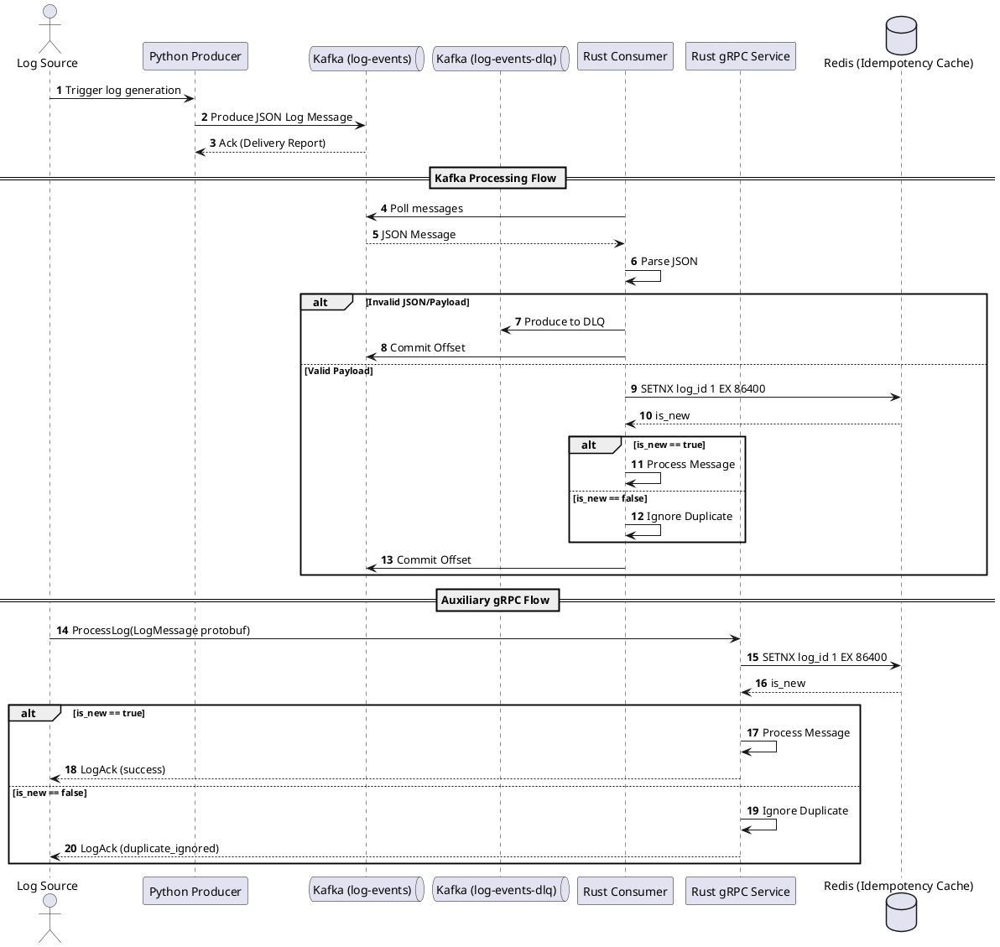

# Architecture Overview of Distributed Message Queue System

This document outlines the architecture, design, and flow of the Distributed Message Queue System.

## Architecture & Idea
The system is designed as a distributed data pipeline simulating real-time log ingestion, processing, and forwarding. 
It uses Kafka as the core message broker to decouple the producers (log generators) from the consumers (log processors). 

The architecture bridges a Python-based ecosystem (commonly used for data ingestion/scripts) with a Rust-based backend (used for high-performance, safe processing).

### Components
1. **Python Producer**: Generates simulated log events in JSON format and publishes them asynchronously to the Kafka topic `log-events`.
2. **Kafka & Zookeeper**: The message broker that stores and distributes events.
3. **Redis**: An in-memory data store used as a distributed lock and deduplication cache to ensure idempotency across multiple consumers.
4. **Rust Kafka Consumer**: The primary high-performance consumer that reads directly from `log-events`. It uses Redis for cross-instance deduplication (using `SETNX` logic with a TTL). It processes valid JSON and pushes poisoned/failed messages to a Dead Letter Queue (`log-events-dlq`).
5. **Rust gRPC Service**: An auxiliary high-performance backend service that receives logs over gRPC for non-Kafka clients. It shares the same Redis backend for deduplication, ensuring consistent idempotency across different ingest protocols.

## Code Flow
1. The **Producer** generates a dictionary with log details, serializes it to JSON, and sends it asynchronously to Kafka.
2. The **Rust Kafka Consumer** polls Kafka for messages.
3. For each message, it attempts JSON decoding and validation. If parsing fails, it routes the message to the DLQ (`log-events-dlq`) and commits the offset.
4. For valid messages, it extracts `log_id` and checks **Redis** using a `SETNX` operation with a TTL.
5. If the `log_id` is present, it's ignored as a duplicate. Otherwise, it's processed and the offset is committed to Kafka asynchronously.
6. The **Rust gRPC Service** acts as an alternative ingest vector, extracting `log_id` from incoming Protobuf requests and checking the same **Redis** instance for deduplication before processing.

## Sequence Diagram

