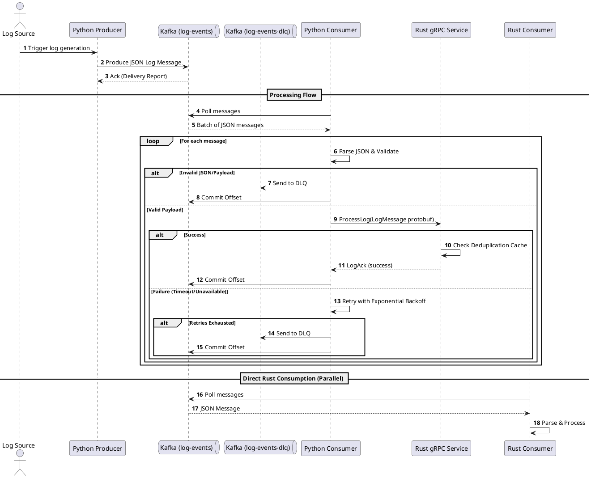

# Architecture Overview of Distributed Message Queue System

This document outlines the architecture, design, and flow of the Distributed Message Queue System.

## Architecture & Idea
The system is designed as a distributed data pipeline simulating real-time log ingestion, processing, and forwarding. 
It uses Kafka as the core message broker to decouple the producers (log generators) from the consumers (log processors). 

The architecture bridges a Python-based ecosystem (commonly used for data ingestion/scripts) with a Rust-based backend (used for high-performance, safe processing).

### Components
1. **Python Producer**: Generates simulated log events in JSON format and publishes them to the Kafka topic `log-events`.
2. **Kafka & Zookeeper**: The message broker that stores and distributes events.
3. **Python Consumer (Bridge)**: Acts as an intermediary. It consumes messages from Kafka, transforms them into Protocol Buffers (`LogMessage`), and forwards them to the Rust backend via gRPC. It handles retries and pushes poisoned/failed messages to a Dead Letter Queue (`log-events-dlq`).
4. **Rust gRPC Service**: A high-performance backend service that receives logs over gRPC, deduplicates them using an in-memory LRU cache (based on `log_id`), and acknowledges the processing.
5. **Rust Kafka Consumer**: An alternative or parallel consumer written in Rust that reads directly from `log-events`. This component demonstrates how Rust can directly consume from Kafka, bypassing the Python-gRPC bridge.

## Code Flow
1. The **Producer** generates a dictionary with log details, serializes it to JSON, and sends it asynchronously to Kafka.
2. The **Python Consumer** polls Kafka in batches (up to 10 records).
3. For each message, it attempts JSON decoding and validation. If it fails, it routes the message to the DLQ and commits.
4. Valid messages are converted to protobuf and sent to the **Rust gRPC Service**.
5. If the gRPC call fails, the Python Consumer retries with exponential backoff.
6. If all retries are exhausted, the message goes to the DLQ.
7. Upon successful gRPC processing (or DLQ routing), the offset is committed to Kafka.
8. The **Rust gRPC Service** extracts `log_id` and checks the LRU cache. If the `log_id` is present, it's ignored (deduplicated). Otherwise, it's processed.

## Sequence Diagram

